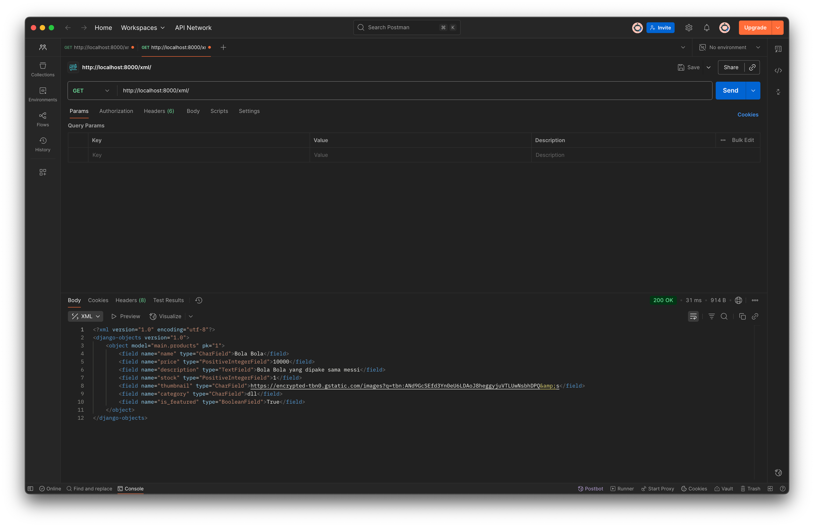
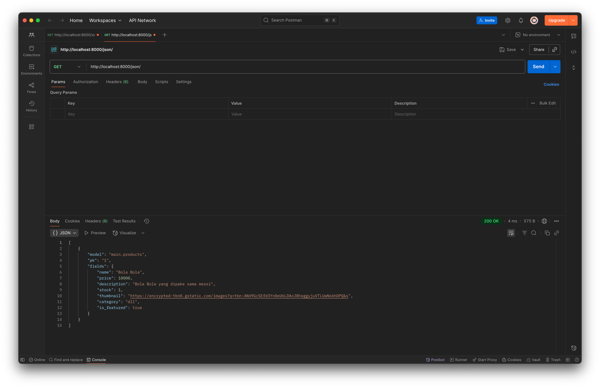
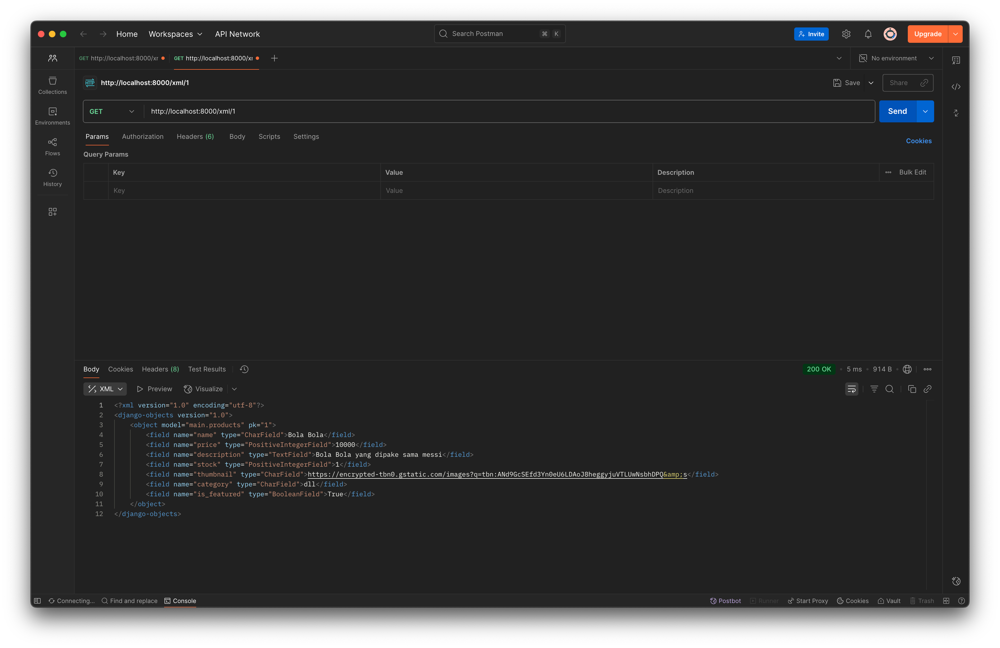
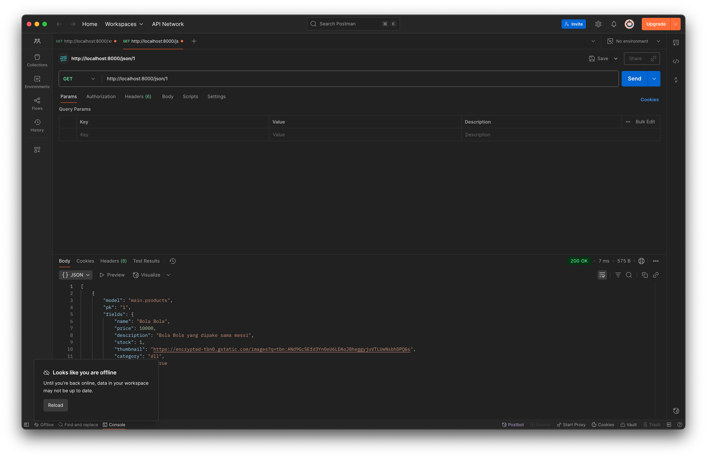

#   Web Sebelah Stadion

Tugas Individu Matkul PBP Fasilkom UI

- Nama :  Firos Aqiela Zufa 
- NPM : 2406412972
- Kelas : PBP F


## DEPLOY LINK

- [LINK PWS](https://firos-aqiela-sebelahstadion.pbp.cs.ui.ac.id)
- [Tugas Individu 2](#Tugas-Individu-2)
- [Tugas Individu 3](#Tugas-Individu-3)
- [Tugas Individu 4](#Tugas-Individu-4)


## Tugas Individu 2

### STEP BY STEP

1. Membuat Proyek Django
- Membuat file `requirements.txt` dan mengcopy isinya dari Tutorial-0
- buat virtual environment dengan `python3 -m venv env` lalu aktifkan dengan `source env/bin/activate` lalu install requirements
- start project dengan `django-admin startproject sebelah_stadion .`

2. Membuat Aplikasi Main
- jalankan `python manage.py startapp main` untuk membuat aplikasi main
- buka file `settings.py` dan tambahkan `'main'` pada variable `INSTALLED_APPS`

3. Implementasi Model
- pada direktori `main` buka file `models.py` dan buat Class `Products`
- tambahkan atribut yang diminta Tugas Individu 2 kedalam class tersebut

4. Implementasi Views
- pada direktori `main` buka file `views.py` 
- buat sebuah fungsi yang menampilkan `nama aplikasi`, `nama`, dan `kelas`

5. Konfigurasi Routing Urls
- buatlah berkas `urls.py` di dalam direktori `main`
- isi dengan 
```bash
from django.urls import path
from main.views import show_main

app_name = 'main'

urlpatterns = [
    path('', show_main, name='show_main'),
]
```
- note : isi dari urlpatterns dan fungsi yang diimport berdasarkan nama fungsi yang dibuat
- buka berkas `urls.py` di dalam direktori `sebelah-stadion`
- import fungsi `include` dari `django.urls`
- tambahkan rute yang mengarahkan ke tampilan di dalam list `urlpatterns`

6. Deploying Web
- buat project pada PWS
- push dari branch master ke PWS

### Question and Answer

1. Buatlah bagan yang berisi request client ke web aplikasi berbasis Django beserta responnya dan jelaskan pada bagan tersebut kaitan antara `urls.py`, `views.py`, `models.py`, dan berkas `html`.


- Dalam ekosistem Django, keempat komponen ini bekerja secara sinergis membentuk pola arsitektur MVT (Model-View-Template). urls.py berperan sebagai router yang memetakan URL permintaan client ke fungsi view yang sesuai. Setiap pola URL didefinisikan untuk mengarahkan permintaan tertentu ke view tertentu. views.py bertindak sebagai penghubung antara model dan template; view menerima permintaan HTTP, memproses logika bisnis, berinteraksi dengan model untuk mengambil atau memanipulasi data dari database, dan kemudian melewatkan data tersebut ke template untuk dirender. models.py mendefinisikan struktur data aplikasi dan menyediakan abstraction layer untuk berinteraksi dengan database melalui ORM (Object-Relational Mapping) Django. Terakhir, berkas HTML (templates) bertanggung jawab untuk presentation layer, menampilkan antarmuka pengguna dengan data yang diterima dari view menggunakan sintaks template Django yang memungkinkan penampilan data dinamis. Keempat komponen ini membentuk alur kerja yang kohesif: URL routing → logika view → manipulasi data → rendering template.

2. Jelaskan peran `settings.py` dalam proyek Django!
- Berkas settings.py memiliki peran sangat penting dalam proyek Django karena di dalamnya tersimpan seluruh konfigurasi utama aplikasi. Beberapa hal yang diatur di dalam settings.py antara lain koneksi database, daftar aplikasi yang digunakan, konfigurasi keamanan seperti secret key, pengaturan bahasa dan zona waktu, hingga pengaturan terkait media dan static files. Dengan kata lain, settings.py menjadi pusat kontrol yang menentukan bagaimana aplikasi berjalan, berkomunikasi dengan database, serta menampilkan konten.

3. Bagaimana cara kerja migrasi database di Django?
- Migrasi database di Django bekerja sebagai mekanisme untuk menerjemahkan perubahan yang dilakukan pada models.py ke dalam bentuk perubahan nyata pada struktur database. Saat developer membuat atau mengubah model, Django menyediakan perintah makemigrations untuk membuat file migrasi yang berisi instruksi perubahan. Setelah itu, perintah migrate dijalankan agar instruksi tersebut dieksekusi dan diterapkan pada database. Dengan sistem migrasi ini, pengembang tidak perlu menulis query SQL secara manual untuk membuat tabel atau mengubah skema database, sehingga pengelolaan database menjadi lebih efisien dan terkontrol.

4. Menurut Anda, dari semua framework yang ada, mengapa framework Django dijadikan permulaan pembelajaran pengembangan perangkat lunak?

- Django sering dijadikan framework awal dalam pembelajaran pengembangan perangkat lunak karena sifatnya yang “batteries included”, artinya sudah menyediakan banyak fitur bawaan yang lengkap, mulai dari autentikasi pengguna, ORM untuk database, hingga sistem templating. Hal ini memudahkan pemula untuk memahami konsep fundamental pengembangan web tanpa harus membangun semua dari nol. Selain itu, Django memiliki dokumentasi yang jelas dan komunitas yang besar sehingga memudahkan proses belajar. Dengan kerangka kerja yang rapi, terstruktur, dan berbasis prinsip MVC (Model-View-Controller), Django memberikan gambaran nyata bagaimana aplikasi web modern dikelola, sehingga cocok sebagai titik awal untuk belajar framework lain di masa depan.


## Tugas Individu 3

### Question and Answer

1. Jelaskan mengapa kita memerlukan data delivery dalam pengimplementasian sebuah platform?
- Dalam pengimplementasian sebuah platform, data delivery sangat dibutuhkan karena menjadi mekanisme utama pertukaran data antar komponen sistem. Dengan data delivery, server, client, maupun layanan mikro (microservices) dapat berkomunikasi secara efisien dan konsisten. Tanpa adanya mekanisme ini, integrasi data akan sulit, proses sinkronisasi menjadi lambat, dan platform tidak mampu memberikan respon real-time. Data delivery juga mendukung interoperabilitas antar teknologi yang berbeda sehingga platform lebih mudah diskalakan dan dikembangkan.

2. Menurutmu, mana yang lebih baik antara XML dan JSON? Mengapa JSON lebih populer dibandingkan XML?
- JSON lebih populer dibanding XML karena ringan, cepat, mudah dipahami, dan langsung cocok dengan JavaScript (bahasa utama web). XML masih digunakan pada kasus tertentu (misalnya konfigurasi atau industri lama), tetapi JSON lebih dominan untuk API modern.

3. Jelaskan fungsi dari method `is_valid()` pada form Django dan mengapa kita membutuhkan method tersebut?
- Method `is_valid()` pada form Django digunakan untuk mengecek dan memvalidasi data yang diinput oleh pengguna. Proses ini memastikan setiap field terisi lengkap, mengikuti format yang benar, dan memenuhi aturan validasi yang telah ditentukan. Dengan adanya `is_valid()`, data yang diterima aplikasi menjadi lebih terkontrol, aman, serta sesuai standar sebelum diproses atau disimpan lebih lanjut.

4. Mengapa kita membutuhkan csrf_token saat membuat form di Django? Apa yang dapat terjadi jika kita tidak menambahkan csrf_token pada form Django? Bagaimana hal tersebut dapat dimanfaatkan oleh penyerang?
- `csrf_token` berperan penting dalam mengamankan form dari ancaman Cross-Site Request Forgery (CSRF). Token ini berfungsi sebagai bukti bahwa request POST benar-benar berasal dari situs kita sendiri. Jika `csrf_token` tidak disertakan, server akan menolak request (biasanya muncul error 403), dan celah ini bisa dimanfaatkan penyerang untuk membuat situs berbahaya dengan form tersembunyi. Ketika pengguna yang sedang login membuka situs berbahaya tersebut, browser dapat mengirimkan request berisi kredensial pengguna ke situs asli, sehingga penyerang bisa melakukan tindakan berbahaya tanpa izin pengguna.

### STEP BY STEP


1. Membuat fungsi XML dan JSON
- buka `views.py` pada direktori `main`
- import `HttpResponse` dan `Serializer`
- buat fungsi show_xml dan show_json
- fungsi show_xml dan fungsi show_json akan mentranslate objek menjadi format xml dan JSON
```bash
def show_xml(request):
     product_list = Products.objects.all()
     xml_data = serializers.serialize("xml", product_list)
     return HttpResponse(xml_data, content_type="application/xml")
```
```bash
def show_json(request):
    product_list = Products.objects.all()
    json_data = serializers.serialize("json", product_list)
    return HttpResponse(json_data, content_type="application/json")
```
- buka `urls.py` pada direktori `main` dan import kedua fungsi yang sudah dibuat
- tambahkan path url ke dalam urlpatterns sesuai dengan fungsi yang diimport

2. Membuat fungsi XML by id dan JSON by id
- lakukan step yang sama dengan langkah 1
- perbedaan pada nama fungsi dan isi dari fungsinya
- fungsi by id menggunakan method `.filter` untuk mengambil data dari satu objek saja

3. Membuat halaman form
- buat file `forms.py` pada direktori `main`
- buat class baru yaitu `ProductForms`
- class ini akan berisi jenis model dan fields dari model yang kan digunakan oleh form
- buka file `views.py` pada direktori main dan tambahkan fungsi berikut

```bash
def create_product(request):
    form = ProductForm(request.POST or None)

    if form.is_valid() and request.method == "POST":
        form.save()
        return redirect('main:show_main')

    context = {'form': form}
    return render(request, "create_product.html", context)
```
- buka `urls.py` pada direktori `main` dan tambahkan path ke `urlpatterns`
- buat tombol "add product" pada `main.html` yang akan meredirect ke halaman form
- buka direktori `main/templates` dan buat file `create_product.html` dalam html ini adalah halaman form
- masukan deployment url kedalam `CSRF_TRUSTED_ORIGIN`

4. Membuat halaman menampilkan objek dan detail objek
- pada file `main.html` di direktori buat sebuah loop yang mengiterasi semua objek dan menampilkan data dan buat button "detail product"
- buka file `views.py` pada direktori main dan tambahkan fungsi berikut

```bash
def show_product(request, id):
    product = get_object_or_404(Products, pk=id)

    context = {
        'product': product
    }

    return render(request, "product_detail.html", context)
```

- buka `urls.py` pada direktori `main` dan tambahkan path ke `urlpatterns`
buka direktori `main/templates` dan buat file `product_detail.html` dalam html ini adalah halaman yang menunjukan data dari product

### Screenshot Postman





## Tugas Individu 3

### Question and Answer

1. Apa itu Django AuthenticationForm? Jelaskan juga kelebihan dan kekurangannya.
- Django `AuthenticationForm` adalah sebuah form bawaan yang berfungsi untuk memvalidasi kredensial pengguna (nama pengguna dan kata sandi) saat proses login. Kelebihannya adalah kemudahan penggunaan, keamanan bawaan, dan integrasi penuh dengan sistem autentikasi Django. Namun, kekurangannya adalah kustomisasi yang terbatas, sehingga memerlukan upaya tambahan jika ingin login menggunakan email atau menambahkan field lain.

2. Apa perbedaan antara autentikasi dan otorisasi? Bagaiamana Django mengimplementasikan kedua konsep tersebut?
- Autentikasi adalah proses verifikasi identitas seperti saat memasukkan username dan password. Sementara itu, otorisasi adalah proses menentukan hak akses setelah identitas Anda terverifikasi. Django mengimplementasikan autentikasi melalui `django.contrib.auth` yang menangani akun pengguna dan sesi. Untuk otorisasi, Django menggunakan sistem permissions dan groups yang memungkinkan pengembang memberikan izin spesifik kepada pengguna atau grup pengguna tertentu, seperti izin untuk menambah, mengubah, atau menghapus data.

3. Apa saja kelebihan dan kekurangan session dan cookies dalam konteks menyimpan state di aplikasi web?
- Cookies adalah data kecil yang disimpan di browser klien, membuatnya ringan bagi server tetapi kurang aman karena dapat dimanipulasi oleh pengguna dan memiliki ukuran terbatas. Sebaliknya, session menyimpan data di sisi server dan hanya menempatkan sebuah ID unik di cookie klien. Hal ini membuat session jauh lebih aman dan mampu menampung data yang lebih besar, namun lebih membebani sumber daya server, terutama jika ada banyak pengguna aktif secara bersamaan.

4. Apakah penggunaan cookies aman secara default dalam pengembangan web, atau apakah ada risiko potensial yang harus diwaspadai? Bagaimana Django menangani hal tersebut?
- Secara default, cookies tidak aman dan rentan terhadap risiko seperti Cross-Site Scripting (XSS) dan Cross-Site Request Forgery (CSRF). Namun, Django secara proaktif menangani risiko ini dengan berbagai cara. Django memiliki perlindungan CSRF yang aktif secara otomatis, menyimpan data sesi di sisi server (bukan data sensitif di cookie), serta menggunakan flag `HttpOnly` pada cookie untuk mencegah akses melalui JavaScript. Selain itu, Django juga mendukung flag `Secure` untuk memastikan cookie hanya dikirim melalui koneksi HTTPS yang terenkripsi

### STEP BY STEP


1. Membuat form register
- buka `views.py` pada direktori `main`
- import `UserCreationForm` dan `messages`
- tambahkan fungsi `register`
- fungsi register menghasilkan formulir registrasi secara otomatis dan menghasilkan akun pengguna ketika data di-submit dari form.

```bash
def register(request):
    form = UserCreationForm()

    if request.method == "POST":
        form = UserCreationForm(request.POST)
        if form.is_valid():
            form.save()
            messages.success(request, 'Your account has been successfully created!')
            return redirect('main:login')
    context = {'form':form}
    return render(request, 'register.html', context)
```
- buat file `register.html` pada direktori `main/template`
- buka `urls.py` pada direktori `main` dan tambahkan path ke register

2. Membuat Login dan Logout
- buka `views.py` pada direktori `main`
- import `authenticate`, `login`, `logout`, `UserCreationForm`, `AuthenticationForm`
- tambahkan fungsi `login` dan `logout`
```bash
def login_user(request):
    if request.method == 'POST':
        form = AuthenticationForm(data=request.POST)

        if form.is_valid():
            user = form.get_user()
            login(request, user)
            return response

    else:
        form = AuthenticationForm(request)
    context = {'form': form}
    return render(request, 'login.html', context)

```

```bash
def logout_user(request):
    logout(request)
    return response
```

- buat file `login.html` pada direktori `main/template`
- tambahkan button logout pada `main.html` pada direktori `main/template`
- buka `urls.py` pada direktori `main` dan tambahkan path ke login dan logout
- tambahkan code berikut diatas fungsi `show_main`, `show_product` dan `create_product`

```bash
@login_required(login_url='/login')
```

3. implementasi cookie last_login
- buka `views.py` pada direktori `main`
- pada fungsi login user tambahkan kode ini untuk menyimpan cookie login
```bash
    response = HttpResponseRedirect(reverse("main:show_main"))
    response.set_cookie('last_login', str(datetime.datetime.now()))
```
- pada fungsi `show_main` tambahkan context ini
```bash
...
'last_login': request.COOKIES.get('last_login', 'Never')
...
```
- pada fungsi logout_user tamvahkan kode ini
```bash
    response = HttpResponseRedirect(reverse('main:login'))
    response.delete_cookie('last_login')
```

## Tugas Individu 5

### Question and Answer

1.  Jika terdapat beberapa CSS selector untuk suatu elemen HTML, jelaskan urutan prioritas pengambilan CSS selector tersebut!
- Jika beberapa selector CSS menargetkan elemen HTML yang sama, browser akan menentukan gaya mana yang akan diterapkan melalui sistem prioritas yang disebut spesifisitas (specificity). Anggap saja setiap jenis selector memiliki "skor" kekuatan. Urutan prioritas dari yang paling kuat hingga yang paling lemah adalah: Style In-line, ID, Class, Pseudo-class, dan Atribut, dan yang terakhir adalah Elemen dan Pseudo-elemen.

2. Mengapa responsive design menjadi konsep yang penting dalam pengembangan aplikasi web? Berikan contoh aplikasi yang sudah dan belum menerapkan responsive design, serta jelaskan mengapa!
- Responsive design adalah konsep fundamental dalam pengembangan web modern karena bertujuan untuk memberikan pengalaman pengguna (user experience) yang optimal di berbagai perangkat dengan ukuran layar yang berbeda, mulai dari desktop, tablet, hingga ponsel. Pentingnya konsep ini didasari oleh tiga hal utama: mayoritas trafik internet saat ini berasal dari perangkat mobile, pengalaman pengguna yang baik meningkatkan retensi dan kepuasan pengguna, serta mesin pencari seperti Google memprioritaskan situs yang mobile-friendly dalam peringkat pencariannya. Contoh aplikasi yang telah menerapkan responsive design dengan sangat baik adalah Tokopedia. 

3. Jelaskan perbedaan antara margin, border, dan padding, serta cara untuk mengimplementasikan ketiga hal tersebut!
- Perbedaan antara margin, border, dan padding paling mudah dipahami dengan konsep CSS Box Model, yang membayangkan setiap elemen HTML sebagai sebuah kotak. Analogi terbaiknya adalah sebuah bingkai foto. Padding adalah ruang transparan di dalam bingkai, yaitu antara foto (konten) dengan bingkainya. Border adalah bingkainya itu sendiri, yang mengelilingi konten dan padding. Terakhir, Margin adalah ruang transparan di luar bingkai, yaitu jarak antara bingkai tersebut dengan dinding atau bingkai foto lainnya. Ketiga properti ini diimplementasikan dalam CSS dengan properti masing-masing: `padding: 10px;`, `border: 1px solid black;`, dan `margin: 15px;`. 

4. Jelaskan konsep flex box dan grid layout beserta kegunaannya!
- Flexbox dan Grid adalah dua sistem layout modern di CSS yang digunakan untuk mengatur posisi dan tata letak elemen dengan jauh lebih mudah dan efisien dibandingkan metode lama. Flexbox (Flexible Box Layout) dirancang untuk layout satu dimensi, baik sebagai baris (row) maupun kolom (column). Kegunaan utamanya adalah untuk mengatur alignment dan distribusi ruang di antara item-item dalam sebuah container. Contoh sempurna penggunaan Flexbox adalah pada navbar, di mana Anda ingin logo berada di kiri, daftar menu di tengah, dan tombol login di kanan, semuanya sejajar secara rapi. Grid Layout, di sisi lain, dirancang untuk layout dua dimensi yang lebih kompleks, yaitu baris dan kolom secara bersamaan, mirip seperti tabel atau spreadsheet. Kegunaan utama Grid adalah untuk tata letak halaman secara keseluruhan, seperti membuat layout yang terdiri dari header, sidebar, konten utama, dan footer. Grid juga sangat ideal untuk membuat galeri gambar atau dashboard yang memerlukan penataan item dalam baris dan kolom yang presisi.

### STEP BY STEP

1. menambahkan Tailwind kedalam projek
- Buka file `templates/base.html`
- Tambahkan tag `<meta name="viewport">` dan skrip Tailwind di dalam `<head>`
- Buat folder `static` di root direktori proyek, dan di dalamnya buat folder `css`
- Buat file `static/css/global.css`
- Buka `settings.py` dan konfigurasikan `MIDDLEWARE` dan `STATIC`

2. buat fungsi edit dan delete
- Buka `main/views.py` pada direktori `main`
- buat fungsi `edit_product` dan `delete_product`
- buat file `edit_product.html` pada direktori `main/template`
- buka `urls.py` pada direktori main dan tambahkan path ke edit dan delete

3. Styling Tailwind
- Buka `static/css/global.css` dan tambahkan class custom untuk form dan checkbox.

```bash
.form-style form input, form textarea, form select {
    width: 100%;
    padding: 0.5rem;
    border: 2px solid #bcbcbc;
    border-radius: 0.375rem;
}
.form-style form input:focus, form textarea:focus, form select:focus {
    outline: none;
    border-color: #16a34a;
    box-shadow: 0 0 0 3px #16a34a;
}

.form-style input[type="checkbox"] {
    width: 1.25rem;
    height: 1.25rem;
    padding: 0;
    border: 2px solid #d1d5db;
    border-radius: 0.375rem;
    background-color: white;
    cursor: pointer;
    position: relative;
    appearance: none;
    -webkit-appearance: none;
    -moz-appearance: none;
}

.form-style input[type="checkbox"]:checked {
    background-color: #16a34a;
    border-color: #16a34a;
}

.form-style input[type="checkbox"]:checked::after {
    content: '✓';
    position: absolute;
    top: 50%;
    left: 50%;
    transform: translate(-50%, -50%);
    color: white;
    font-weight: bold;
    font-size: 0.875rem;
}

.form-style input[type="checkbox"]:focus {
    outline: none;
    border-color: #16a34a;
    box-shadow: 0 0 0 3px rgba(22, 163, 74, 0.1);
}
```
- Pada template form seperti `create_product.html` tambahkan class form-style ke div.
- lakukan styling terhadap `navbar.html`, `login.html`, `register.html`, `main.html`, `card_product.html`, `product_detail.html`, `create_product.html`, dan ` edit_product.html`


