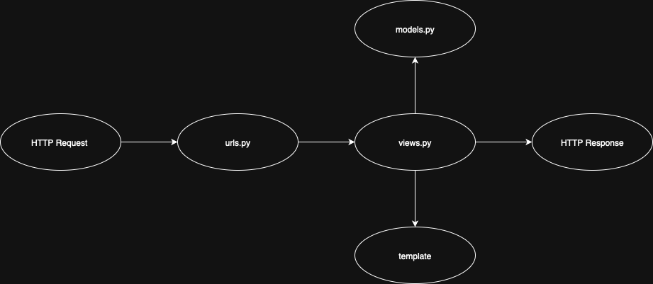

#   Web Sebelah Stadion

Tugas Individu Matkul PBP Fasilkom UI

- Nama :  Firos Aqiela Zufa 
- NPM : 2406412972
- Kelas : PBP F


## DEPLOY LINK

- [LINK PWS](https://firos-aqiela-sebelahstadion.pbp.cs.ui.ac.id)
- [Tugas Individu 2](#Tugas-Individu-2)


## Tugas Individu 2

### STEP BY STEP

1. Membuat Proyek Django
- Membuat file `requirements.txt` dan mengcopy isinya dari Tutorial-0
- buat virtual environment dengan `python3 -m venv env` lalu aktifkan dengan `source env/bin/activate` lalu install requirements
- start project dengan `django-admin startproject sebelah_stadion .`

2. Membuat Aplikasi Main
- jalankan `python manage.py startapp main` untuk membuat aplikasi main
- buka file `settings.py` dan tambahkan `'main'` pada variable `INSTALLED_APPS`

3. Implementasi Model
- pada direktori `main` buka file `models.py` dan buat Class `Products`
- tambahkan atribut yang diminta Tugas Individu 2 kedalam class tersebut

4. Implementasi Views
- pada direktori `main` buka file `views.py` 
- buat sebuah fungsi yang menampilkan `nama aplikasi`, `nama`, dan `kelas`

5. Konfigurasi Routing Urls
- buatlah berkas `urls.py` di dalam direktori `main`
- isi dengan 
```bash
from django.urls import path
from main.views import show_main

app_name = 'main'

urlpatterns = [
    path('', show_main, name='show_main'),
]
```
- note : isi dari urlpatterns dan fungsi yang diimport berdasarkan nama fungsi yang dibuat
- buka berkas `urls.py` di dalam direktori `sebelah-stadion`
- import fungsi `include` dari `django.urls`
- tambahkan rute yang mengarahkan ke tampilan di dalam list `urlpatterns`

6. Deploying Web
- buat project pada PWS
- push dari branch master ke PWS

### Question and Answer

1. Buatlah bagan yang berisi request client ke web aplikasi berbasis Django beserta responnya dan jelaskan pada bagan tersebut kaitan antara `urls.py`, `views.py`, `models.py`, dan berkas `html`.


- Dalam ekosistem Django, keempat komponen ini bekerja secara sinergis membentuk pola arsitektur MVT (Model-View-Template). urls.py berperan sebagai router yang memetakan URL permintaan client ke fungsi view yang sesuai. Setiap pola URL didefinisikan untuk mengarahkan permintaan tertentu ke view tertentu. views.py bertindak sebagai penghubung antara model dan template; view menerima permintaan HTTP, memproses logika bisnis, berinteraksi dengan model untuk mengambil atau memanipulasi data dari database, dan kemudian melewatkan data tersebut ke template untuk dirender. models.py mendefinisikan struktur data aplikasi dan menyediakan abstraction layer untuk berinteraksi dengan database melalui ORM (Object-Relational Mapping) Django. Terakhir, berkas HTML (templates) bertanggung jawab untuk presentation layer, menampilkan antarmuka pengguna dengan data yang diterima dari view menggunakan sintaks template Django yang memungkinkan penampilan data dinamis. Keempat komponen ini membentuk alur kerja yang kohesif: URL routing → logika view → manipulasi data → rendering template.

2. Jelaskan peran `settings.py` dalam proyek Django!
- Berkas settings.py memiliki peran sangat penting dalam proyek Django karena di dalamnya tersimpan seluruh konfigurasi utama aplikasi. Beberapa hal yang diatur di dalam settings.py antara lain koneksi database, daftar aplikasi yang digunakan, konfigurasi keamanan seperti secret key, pengaturan bahasa dan zona waktu, hingga pengaturan terkait media dan static files. Dengan kata lain, settings.py menjadi pusat kontrol yang menentukan bagaimana aplikasi berjalan, berkomunikasi dengan database, serta menampilkan konten.

3. Bagaimana cara kerja migrasi database di Django?
- Migrasi database di Django bekerja sebagai mekanisme untuk menerjemahkan perubahan yang dilakukan pada models.py ke dalam bentuk perubahan nyata pada struktur database. Saat developer membuat atau mengubah model, Django menyediakan perintah makemigrations untuk membuat file migrasi yang berisi instruksi perubahan. Setelah itu, perintah migrate dijalankan agar instruksi tersebut dieksekusi dan diterapkan pada database. Dengan sistem migrasi ini, pengembang tidak perlu menulis query SQL secara manual untuk membuat tabel atau mengubah skema database, sehingga pengelolaan database menjadi lebih efisien dan terkontrol.

4. Menurut Anda, dari semua framework yang ada, mengapa framework Django dijadikan permulaan pembelajaran pengembangan perangkat lunak?

- Django sering dijadikan framework awal dalam pembelajaran pengembangan perangkat lunak karena sifatnya yang “batteries included”, artinya sudah menyediakan banyak fitur bawaan yang lengkap, mulai dari autentikasi pengguna, ORM untuk database, hingga sistem templating. Hal ini memudahkan pemula untuk memahami konsep fundamental pengembangan web tanpa harus membangun semua dari nol. Selain itu, Django memiliki dokumentasi yang jelas dan komunitas yang besar sehingga memudahkan proses belajar. Dengan kerangka kerja yang rapi, terstruktur, dan berbasis prinsip MVC (Model-View-Controller), Django memberikan gambaran nyata bagaimana aplikasi web modern dikelola, sehingga cocok sebagai titik awal untuk belajar framework lain di masa depan.


